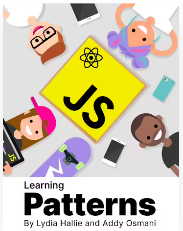

# Patterns-JS

Learning about patterns

	
    

Learning about Patterns oriented on Javascript Language, It uses Addy Osmani's book called "Learning Javascript Design Patterns, a javascript and jquery developer's guide"

and there exist another learning path, by Lydia Hallie and Addy Osmani, awesome web page about patterns, you will find here [patterns.dev](https://www.patterns.dev/) and download the book if you want

