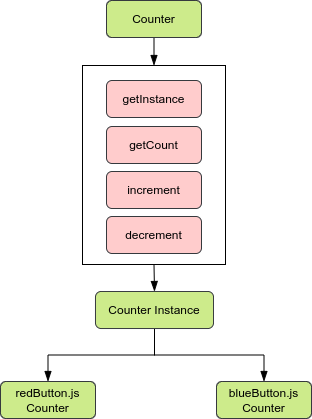

# The Singleton Pattern

They are classes which only has one instance, and can be access globally.

If we create a variable outside of the class and pass in the first time the object created (this) and the next time that it needs create it only pass the reference because it has already created. So
we have only one instance of Counter class like this




```js
let instance;

class Counter{
  constructor(){
    if(instance){
      throw new Error("You can only create one instance!");
    }
    instance = this;
  }
}
```

There exist freeze method in order to avoid changes on this class and mantain the properties of instance without changes like this

```js
const singletonCounter = Object.freeze(new Counter());
export default singletonCounter;
```

## Disadvantages

Singletons are considered an anti-pattern on JavaScript

Javascript you have the power of instancing an object directly, we can use a regular object to achieve the same result.

```js
let count = 0;
const counter = {
  increment(){
    return ++count;
  },
  decrement(){
    return --count;
  }
};

Object.freeze(counter);
export {counter};
```

## Dependency Hiding

If we have other module (SuperCounter) which is not a singleton and we instance this module in index.js with the same name of variable and functions as our "counter singleton", so we modify singleton pattern "counter singleton" but we want to
call functions for SuperCounter. So the power of sharing a singleton module spreads in all files and we need to avoid other modules which don't have the same behavior as our Counter Singleton.

## Global Behaviour

Having a global variable is generally considered as a bad design decision. It is considered Global scope pollution

If for some reason you accidentally overwriting the global variable but you don't wanted. It results in unexpected behaviour.

the new let and const keywords avoid this. because they have block-scope, in other words if you write or modify global variable it should be defined and throw and error if you use the variable before
you declared it. so blocking the scope.

you could export this variables and import in other files, so you have the control of global variable avoiding polluting global scope.

The order of actions are important, first create data and then consume, so block scope avoid thisif it is the first time to creation, the class create the instance. but sometimes some module wnats to
consume data and thinks that object have already been created. let and const have the power !


## State Management in React

There exist in React state management tools like Redux or React Context instead of using Singletons, but these tools have read-only action, they don't let to mutate objects many times.
When you use Redux you could use reducers in order to update data before a component sent an actions through a dispatcher.


